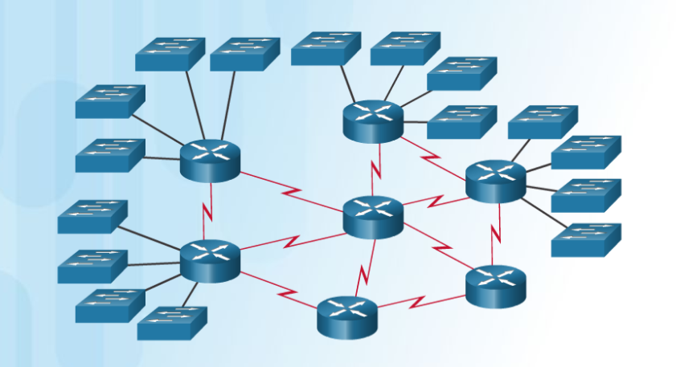
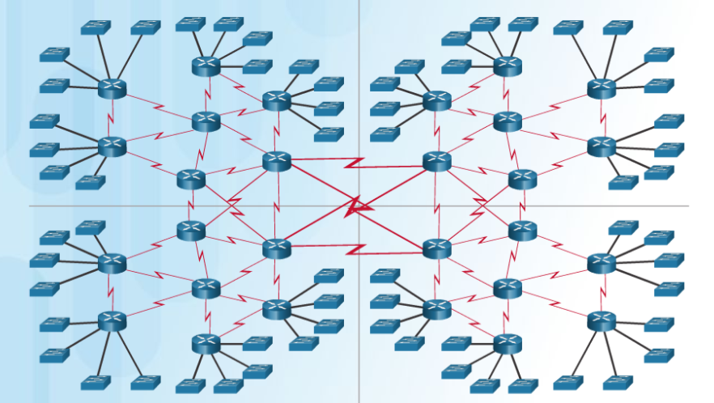

# Tenth week

This week will be all about the Dynamic routing and also chapter four: Switching Networks.

## Chapter 3
In this one, we are gonna compare the static routing with dynamic. And first thing to mention, there is so many dynamic routing protocols: RIP, OSPF, IS-IS, IGRP, EIGRP, BGP. This is kinda interesting, why so many?

As I found, dynamic routing protocols are classified by Internet Protocol version, are they interior or exterior gateway protocols, is it distance vector or link-state or path vector.

The very **basics of dynamic routing** are: exchanging routing information and populating routing tables with such information that helps choose the best path.

The purpose of all this is:
1. Easily discover remote networks
1. Maintaining up-to-date routing information
1. Choosing the best path to destination networks
1. Ability to find a new best path if current is not available

Also to mention **the main components of dynamic routing:**
- Data structures - typically databases of routing tables stored in RAM
- Routing protocol messages - information that is going to be shared with other routers
- Algorithm - Best path determination

Firstly I have got a few questions like: why we need this?

Then I bumped into this picture:

If I will ever think of any additional questions, I can always recall this one:

To be honest, there is nothing in the world that will ever make me configure this statically. To sum up, if I were the one who administrated this network, I would totally use the dynamic routing or at least automate this with some script.

But, there is fact and it's a strong one. Even if I deeply wanted to automate such or use dynamic routing protocols, firstly I need to fully understand the whole concept.

**Advantages of such** is fully understandable:
- Suitable in all different kinds of network topologies
- It's scale-independent
- Automatically adapts topology to reroute traffic

**Disadvantages**:
- More complex to implement
- Less secure, therefore additional configurations is needed
- Route depends on current topology
- Requires additional CPU, RAM, and link bandwidth

After exposing the true nature of dynamic routing, The RS2 book decided to introduce the concept more in-depth using RIP. So, RIP is actually is not in-use nowadays, however it's suitable to understand basics.

Firstly, to activate the RIP use `router rip` command in global configuration mode.
To disable RIP use `no router rip`. After activating RIP, we are entering the RIP configuration space, where we can obviously configure the RIP.

Next, we should enable RIP routing for a network. Using `network network-address` command. To verify everything, we use `show ip protocols`.

Now, after basics I am being introduced with RIPv2. To activate second version, in RIP configuration use `version 2` command. After configuring RIPv2 we should be warned that now we are not receiving any RIPv1 messages, therefore if we are about to configure the second version of RIP, we always should apply such configurations to all routers on the network.

RIPv2 automatically summarizes networks, to disable it we use `no auto-summary` command. Also, when we are configuring router interfaces in RIP, it also means that RIP is gonna broadcast messages ti all the interfaces configured in RIP. To prevent that, we can specify the interface that is going to be send as information for other routers, but router will not send RIP messages to this interface. We can do so by applying `passive-interface interface` command.

When we are configuring the edge router, we should configure **propagation** on it. We can do so, by applying these steps:
- A default static route using the `ip route 0.0.0.0 0.0.0.0` command
- `default-information originate` router information command, this will propagate default static route in RIP updates.

In table entries that we learned in previous chapter we now have got another route source marked with *R* that means RIP.

Routes are always discussed in terms of:
- Ultimate route
- Level 1 route
- Level 1 parent route
- Level 2 child routes

**Ultimate route** is a routing table entry that contains either a next-hop IPv4 address or an exit interface.

**Level 1 route** is a route with a subnet mask equal or less than the classful mask, therefore it can be:
- Network route
- Supernet route
- Default route

**Level 1 parent route** is a Level 1 route that is subneted, it can never become an ultimate route.

**Level 2 child route** is a ultimate route under the Level 1 parent route.

When we are speaking of route types in terms of IPv6, remember, there is no other types other than ultimate route when we are using IPv6.

Overall, that is all I have got for this chapter.

## Chapter 4 - Switched Networks
In this chapter we are going to discuss the modern requirements and some of the current network designs modules.

To mention: nowadays world uses **converged networks** design, which simply means that any type of host device and network traffic uses one network (one physical network). That one gives us a flexibility when we are building any kind of network.

What is Cisco borderless switched network? Well it is said, that it is modern network design template that provides us flexibility and accessability. Main principles of such are:
- Hierarchical - network must be divided into different tiers
- Modularity - Allows seamless network to be integrated at on-demand basis
- Resiliency - Makes network be always on
- Flexibility - Intelligent traffic load by using and sharing all the network resources

There are **Three main layers** in any network architecture:
1. Access layer - from which end-users are connecting to the network
1. Distribution layer - provides us with these useful functions:
    - Aggregating large-scale wiring closet networks
    - Aggregating Layer 2 broadcast domains and Layer 3 routing boundaries
    - Providing intelligent switching, routing, and network access policy functions to access the rest of the network
    - Providing high availability through redundant distribution layer switches to the end-user and equal cost paths to the core
    - Providing differentiated services to various classes of service applications at the edge of the network
1. Core layer - is a backbone of the network, connecting the other blocks and campuses.

What is a **form factor?** It is a defines the physical properties of something in the context of designing system or anything else. Some switch types:
- Fixed configuration switches - do not support configurations that are beyond the default/originally features that came with the switch.
- Modular configuration switches - more flexible because of the line card that can be expanded with any kind of port.
- Stackable configuration switches - switches that can be interconnected

Next topics was already discussed in the previous book. I already know about different switching methods. 

Overall, that is all I have got for this chapter (because it's literally small)
