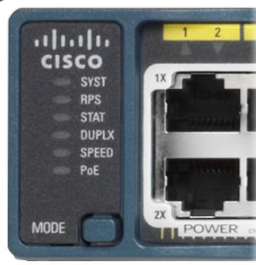

# Eleventh week

Well, I'm here again. This week we have got fifth chapter and nothing else I think.
However, I'm gonna to pass all the previous chapters, because of some issues with labs. It is going to be second, third, fourth and fifth chapters.

Tomorrow I have got a lab, so let's finish with it.

## Fifth chapter - Switch Configuration

From the name we can obtain the whole information about current chapter. Let's apply some configurations on Cisco's Switches. To be clear, they are self-contained and can be easily deployed and used out of box, however they can be configured in the way they can meet network requirements more accurately.

First of all, let's discuss the **boot sequence**. I already covered some of these in the previous book, but now with more additional information. After switch is powered on it goes through this:
- POST is loaded from ROM and applied to CPU subsystem and it's DRAM
- Loads the boot loading software immediately after the POST
- The boot loader performs low-level CPU initialization
- The boot loader initializes the flash file system
- Finally, the boot loader locates and loads the IOS image into the memory and gives control to switch

Another case is when IOS is damaged. In such cases, we still can access **command-line** through what we can access the file system. It can be done by connecting the console port after what these procedure needs to be done:
- Connect to the switch
- Unplug the switch power cord
- Reconnect the power cord and within 15 seconds press and hold the *Mode* button while the system LED is flashing green
- Continue pressing *Mode* button until LED turns to briefly amber and then solid green.
- Release *Mode* button

From such CLI we can restore the IOS.

From what you see above, this is a Cisco Catalyst switch LED indicators. This is what kind of information they can provide you:
- SYST - is switch receiving power
- RPS - if it is green RPS is on and ready to provide back-up power
- STAT - indicates that the port status LED is selected when LED is green
- DUPLX - if the port is green switch works in full-duplex mode
- SPEED - if it's off, then 10Mb/s if green, then 100Mb/S if blinking, then 1000Mb/s
- PoE - power over Ethernet

In order to configure switch remotely, we first need to configure it via console port. And to do so, use command `interface vlan vlan-id` to create vlan with id, after so use `ip address ip-address subnet-mask` command to assign ip address to it. Remember to enable the created interface with `no shutdown` command.

To associate the created vlan with the actual interface, enter the interface configuration mode and use `switchport access vlan vlan-id` command.

**Default gateway** can be configured with the `ip default-gateway ip-address` command.

I already know about Full-duplex and Half-duplex modes, so I will skip this. However there's a new commands that needs to be written. We can specify the duplex mode for interface using `duplex {full | half}` command. Also `speed [speed]` command which sets the speed for this interface.

From the book RS1 we heard of auto-MDIX, so here's the command how to configure it on the switch `mdix auto`.

**show** command displays all the information we need:
- `show interfaces [interface-id]` - display interface status and configuration
- `show startup-config` - display current startup configuration
- `show running-config` - display current running configuration
- `show flash` - display information about flash file system
- `show version` - display system hardware and software status
- `show history` - display history of commands entered
- `show ip [interface-id]` - display IP information about interface
- `show mac address-table` - display the MAC address table

Next few things to do to configure **SSH**:
- To verify that SSH is supported by switch `show ip ssh`
- Configure the `ip domain-name [domain-name]`
- Configure SSH version 2 using `ip ssh version 2`
- Generate RSA key pairs using `crypto key generate rsa` (to delete use `crypto key zeroize rsa`)
- Create username and password using `username [username] secret [password]`
- Open vty lines (0-15) and use `transport input ssh`
- `login local` command on vty lines

Finally I learned really useful command `interface range type module/first-number last-number`

Port Security types:
- **Static secure** - activated by `switchport port-security mac-address [mac-address]`, stored in the running-configurations
- **Dynamic secure** - dynamically learned and stored only in the address table
- **Sticky secure** - can be dynamically learned or manually configured (activated by `switchport port-security mac-address sticky`). To manually add sticky mac-address use `switchport port-security mac-address sticky [mac-address]` command.

We configure **violation mode** on a switch to specify the action when violations occur:
- Protect - drop the packet with unknown source addresses. No notifications is being received
- Restrict - same as protect but notifications are received
- Shutdown (default) - if violation occurs, the interface will be immediately error-disabled

You can configure these violation modes with command: `switchport port-security violation {protect | restrict | shutdown}`;

Also some useful commands to configure Port Security:
- `switchport mode access` - set the interface mode
- `switchport port-security` - enable port security on interface
- `switchport port-security maximum [number]` - set the maximum number of secure addresses allowed
- `switchport port-security mac-address sticky` - enable sticky learning

All of above applied to some interface. And to show the information `show port-security interface [interface-id]`

Overall, that's all I have got for this chapter.
