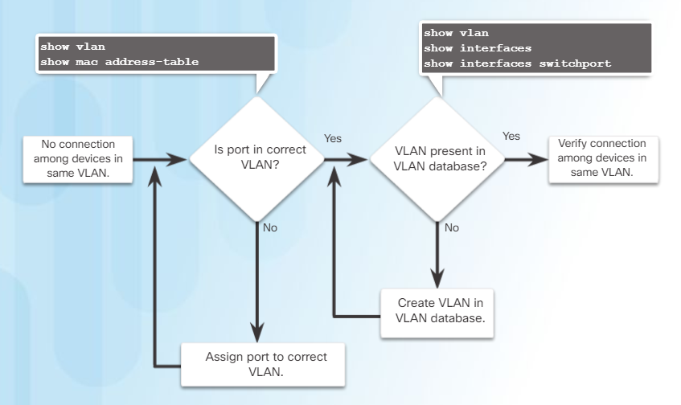
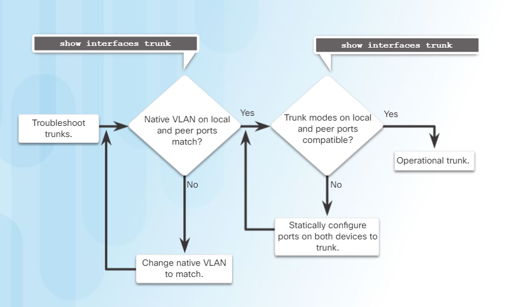

# Week twelve

Hello, everyone who's reading this (no one actually in fact based on my repo's statistics). However, Im still writing this post, is it making me hopelessly hopeless? Well no, if you think of it in the way that I'm thinking, and what I'm thinking is the fact that I'm learning computer networks.

At this week we've got a big one chapter, explaining virtual local area network or simply VLAN.

## Chapter 6: Virtual Local Area Network (VLAN)

From introduction part I learned that VLAN is used for only one purpose: **segmenting broadcast areas**.

First thing to mention is that VLANs areas are based on **logical connections** instead of **physical**. Separation depends on factors such as: function, project team, application **without thinking** of physical connections. VLAN connections are as the same as if devices **sharing same VLAN are connected together** by cables.

After receiving the knowledge of what it is, let's take all the **benefits** into account and try to breakdown all of them:
- Security
- Cost reduction
- Better performance
- Reduce size of broadcast domains
- Improved IT staff efficiency
- Simpler project and application management

Now let's consider a different **types** of VLAN:
- **Data VLAN** - used to separate the networks into groups of users or devices
- **Default VLAN** - using `show vlan brief` we can display all the vlans and assigned ports. By default all the switch's ports are assigned to vlan 1 which has name of default. Default vlans has the same features as the other types, however it cannot be renamed or deleted
- **Native VLAN** - are configured on unused VLAN port as trunk port
- **Management VLAN** - are used to manage switch using assigned ip address to it

After basic introduction into the VLAN, here I have the packet tracer task in which we are exploring broadcast areas. The main thing is, that in multi-switched network VLAN could not work without VLAN trunks.

**Tagging** Ethernet frames for VLAN identification is main thing in VLAN trunking. VLAN tag field details:
- Type
- User Priority
- Canonical Format Identifier (CFI)
- VLAN ID

Now we can try to implement VLAN. A few words about VLAN ranges:
- Normal range VLAN - used in small and medium size businesses and enterprises identified by VLAN ID from 1 - 1005. IDs 1002 through 1005 are reserved. All these IDs are automatically created and cannot be removed. All the information is stored in VLAN database located in the flash memory vlan.dat. VLAN trunking protocol which helps manage VLAN configuration between switches.
- Extended range VLAN - range is identified between 1006 and 4094. Configurations are not written in vlan.dat file.

Finally we are about to create VLAN. Some first useful commands:
- `vlan [vlan-id]` - create a vlan with id number (we can create a multiple vlans using coma-separation)
- `name [vlan-name]` - in vlan config mode, setting unique name for this vlan
- `switchport mode access` - in interface config mode, set the port to access mode
- `switchport access vlan [vlan-id]` - in interface config mode, assign the port to a VLAN
- `switchport voice vlan [vlan-id]` - in interface config mode, assign a voice VLAN to a port
- `mls qos trust [cos | device cisco-phone | dscp | ip-precedence]` - in interface config mode, is used to set the trusted state of an interface, and to indicate which fields of the packet are used to classify traffic
- `no switchport access vlan` - in interface config mode, removes any assigned vlan to the interface
- `no vlan [vlan-id]` - removing vlan with id number
- `delete vlan.dat` - delete all the created vlan

Some variations of **show** command in combination with vlan:
- `show vlan`
- `show vlan brief`
- `show vlan id [vlan-id]`
- `show vlan name [vlan-name]`
- `show vlan summary`

Let's configure trunk between the switches
- `switchport mode trunk` - in interface config mode, forces the link to be a trunk link.
- `switchport trunk native vlan [vlan-id]` - in interface config mode, specify native VLAN for untagged frames
- `switchport trunk allowed vlan [vlan-id]` - in interface config mode, specify the list of VLANs to be allowed on the trunk link
- `no switchport trunk allowed vlan` - in interface config mode, set trunk to allow all VLANs
- `no switchport trunk native` - in interface config mode, reset native VLAN to default

After all the configurations are done, let's study some additional theory.

Each VLAN must correspond to a unique IP subnet.
Always refer to this flowchart in order to troubleshoot the connectionless network with configured VLAN:

This flowchart represents the way we find and troubleshoot the trunk links between switches:

After some hard-going troubleshooting packet tracer lab works, now we are going to discuss inter vlan-routing.

Firstly, netacad idk why showed us legacy implementation of inter vlan-routing which is done by assigning things to physical ports. Router-on-a-Stick on the other side, is the newest type of inter vlan-routing which is not using physical ports, instead all the routings are done by existing cables.

IDK why (second times) they are showing to us Legacy version and how to configure it, but I do not have any other options but to learn it and never use. By the way, configurations are done simply by old assigning-vlan-to-interface method. On router however, we need to apply IP addresses corresponding to VLAN network space.

Finally, after a bit of suffering (actually it was about 5 minutes, so it's ok) we are learning the newest method. It is called Router-on-a-Stick which reminds me of food, but we are loosing the point. So, the inter routing is done by creating a virtual sub-interfaces of one interface.

To enable inter vlan routing using new method, you should start by your switches, by that I mean to enable trunk mode on the ports connecting to the router.

Now we can focus on routers. To create a sub-interface follow, these commands:
- `interface [interface-id].[sub-interface-id]` - to create the sub-interface
- `encapsulation dot1q [vlan-id]` - assigning sub-interface to vlan
- `ip address [ip-address] [subnet-mask]` - assigning ip address to the sub-interface