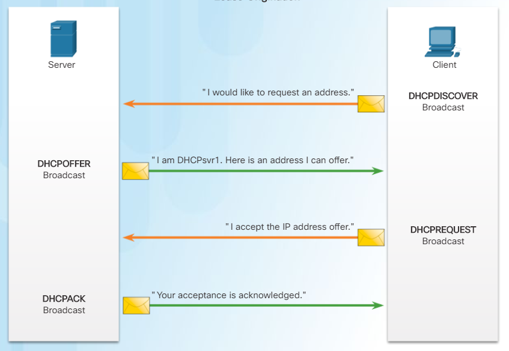
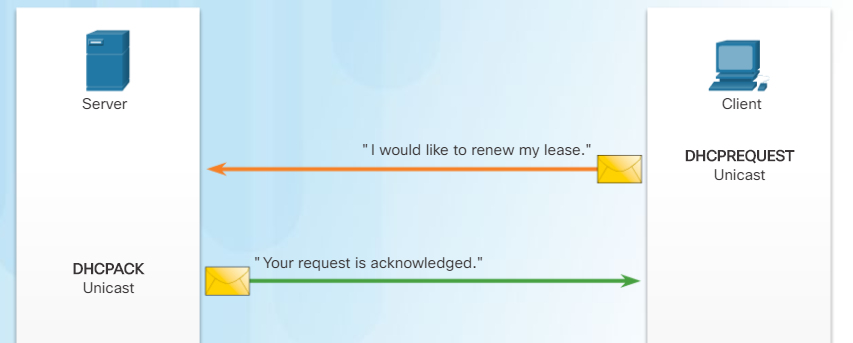
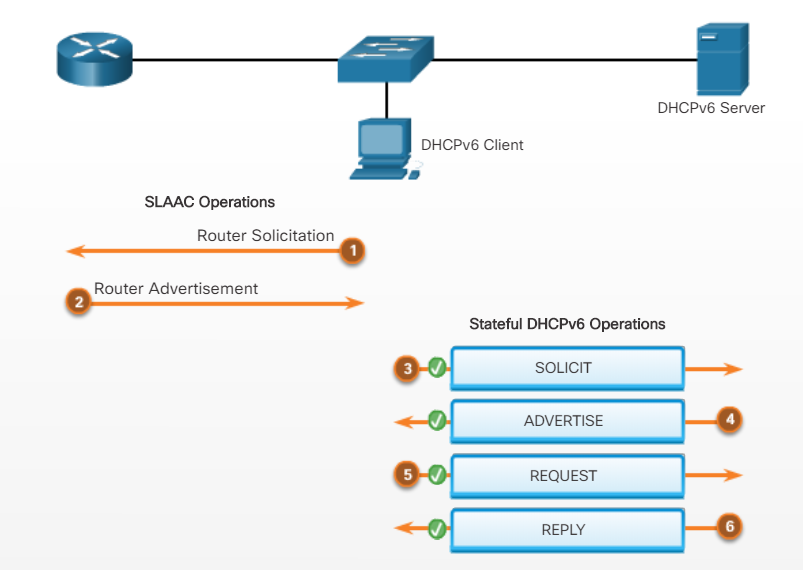

# Week fourteen

This week was absolutely damned 'cause two chapters I need to study. First I thought about spending the whole days on these, however soon I found out they are relatively small.
Previously I was telling you guys about ACL. This chapter will be smaller, we are about to discover a DHCP

## Chapter 8 - DHCP

DHCP states for Dynamic Host Configuration Protocol which helps in configuring big network with a lot topology changes.

**The basics of DHCPv4** is looks like these: DHCP server is configured to send network configuration information dynamically, when host will need this kind of information, it'll send the request that server needs to reply.

In a nutshell this operation is described by following images:

The client must contact the DHCP server periodically to extend the **lease**. This lease mechanism ensures that clients that move or power off do not keep addresses that they no longer need. When a lease expires, the DHCP server returns the address to the pool where it can be reallocated as necessary.

Cisco's routers can be configured as DHCP servers. To do so, we must follow these steps:

1. Step, exclude static ip addresses in network topology using `ip dhcp excluded-address [low-address] [high-address]` command we can exclude range or single static ip address
1. Step, configure a DHCP pool using `ip dhcp pool [pool-name]` command that creates a pool with given name
1. Step, configure specific tasks.  
   - `network [network-number] { mask | /prefix-length }` - address pool
   - `default-router [address...address-8]` - default gateway
   - `dns-server [address...address-8]` - DNS server
   - `domain-name` - define a domain name
   - `lease { [days] | [hours] | [minutes] | infinite }` - set a lease period
   - `netbios-name-server [address...address-8]` - define a NetBIOS WINS server

When the question of verifying DHCP server is up, we can use the following commands:

- `show running-config | section dhcp` - to display currently running DHCP configurations
- `show ip dhcp binding` - display all the IP addresses with MAC addresses that has been assigned by DHCP server
- `show ip dhcp server statistics` - verify that messages are being received or sent by router

Next thing to study is DHCPv4 relay. Useful commands from it:

- `ipconfig /renew` - to send DHCP DISCOVER message across the broadcast domain
- `ipconfig/release` - to renew IPv4 address

There's an issue, when DHCP server is placed in another subnet. One solution is to place one DHCP server per subnet, however this is a bad idea. Another approach is to make routers forward DHCP discover messages using `ip helper-address [address]` command. This process is called relay.

Another case of using DHCP is applying it on routers. Cisco routers can be configured as DHCP servers using `ip address dhcp` interface configuration mode command.

Some commands for troubleshooting DHCPv4:

- `no service dhcp` - it shouldn't be configured
- `debug ip packet`
- `debug ip dhcp server events` - this commands reports server events

After practicing all these commands on Packet Tracer task, I'm going deeply into DHCPv6.
Similar to IPv4, IPv6 global unicast addresses can be configured manually or dynamically. However, there are two methods in which IPv6 global unicast addresses can be assigned dynamically:

- Stateless Address Autoconfiguration (SLAAC)
- Stateful DHCPv6

In a nutshell SLAAC is working with RA and RS messages. RS is send when client wants to obtain addressing information. RA are sent by routers to provide addressing information by what hosts can build their global unicast addresses. RA messages are being sent as reply to RS messages, however routers are sending them periodically. Cisco's routers are sending 1 RA message per 200 seconds by default.

To process the SLAAC operation, follow these instructions:

- `ipv6 unicast-routing` - to make routers forward ipv6 packets
- Client sends RS message as broadcast message to all routers
- Router is replying with RA message containing prefix, prefix-length etc.
- Client generating Interface ID, the prefix, prefix-length are being used to create IPv6 address
- Client is sending message to check whether this IPv6 address exists or not

RA messages are configured by flags M and O are being set to 0, however sometimes flags are being set on different values. In such cases use these:

- `no ipv6 nd managed-config-flag` - to set M flag to 0
- `no ipv6 nd other-config-flag` - to set O flag to 0

Use the `ipv6 nd other-config-flag` command to modify the RA message sent on the interface of a router to indicate stateless DHCPv6.
The following command is used to change the M flag from 0 to 1 to signify stateful DHCPv6: `ipv6 nd managed-config-flag`

Overall steps in DHCPv6 operation are:

Next things to learn is how to configure a stateless DHCPv6 on a Router:

- `ipv6 unicast-routing` - to enable ipv6 routing
- `ipv6 dhcp pool [pool-name]` - to create DHCPv6 pool
- configure pool parameters (dns-server, domain-name)
- `ipv6 dhcp server [pool-name]` - apply DHCPv6 on interface
- `ipv6 nd other-config-flag` - change O flag to 1

And how to configure router as a DHCPv6 client:

- `ipv6 enable` - to enable ipv6 on a interface
- `ipv6 address autoconfig` - enables automatic configuration of ipv6 addressing using SLAAC

Useful commands for checking and debugging:

- `show ipv6 dhcp pool`
- `debug ipv6 dhcp detail`

Commands for configuring Stateful DHCPv6 server on router:

- enable ipv6 routing
- create DHCPv6 pool
- configure pool parameters (dns-server, domain-name) `address prefix prefix/length [lifetime { valid-lifetime | preferred-lifetime | infinite }]`
- apply DHCPv6 on interface
- change O flag to 1

Configure DHCPv6 stateful client:

- `ipv6 enable` - to enable ipv6 on a interface
- `ipv6 address dhcp` - enables router's interface to behave like DHCPv6 client

Useful commands for verifying DHCPv6:

- `show ipv6 dhcp pool`
- `show ipv6 dhcp binding`
- `show ipv6 interface [interface]`

Following command is used to configure relay agent: `ipv6 dhcp relay destination [address]`
