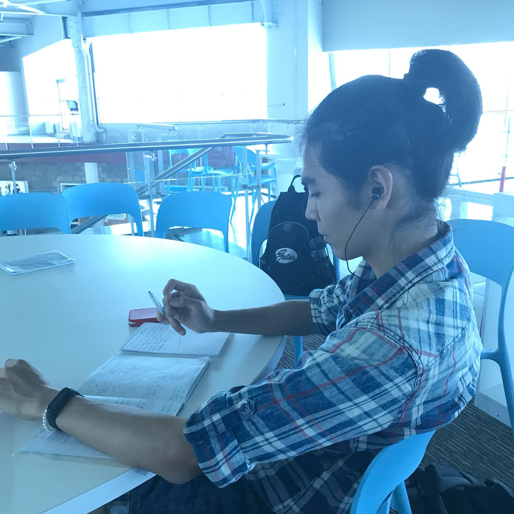

# Third week

Because it is my first week of blogging 
this course, I will make a little 
summary of first week and second.

### First week
My journey started by simple practice 
class where I realized: networks are 
essential and anyone who calls himself 
an engineer must know at least the 
basics. Lecture was all about the 
importance of studying things. Next I 
found on my Suleyman Demirel university 
email the invitation link to my new 
Cisco Networking Academy account in 
which I also found the fact that I was 
already enrolled to the CCNA essentials 
course.  
After finishing this course, students 
of Suleyman Demirel university can take 
an elective course that continues the 
Cisco Networking Academy essential 
course that we are participating now.
 
First week on netacad platform students 
of Suleyman Demirel university studied 
first chapter and also tenths chapter.
First chapter was all about "How the 
networks work". The Internet and WEB 
technologies are nowadays part of our 
lifes and by "our" lifes I mean life of 
every people around the world. The 
Internet is about connecting people, 
collaboration with different groups of 
nations and etc.  
Tenths chapter was all about the Application 
layer of TCP/IP model. Different protocols 
for different purposes. For example:
- HTTP also known as Hyper Text Transfer Protocol
- HTTPS also known as Hyper Text Transfer Protocol Secure
- FTP also known as File Transfer Protocol
- DNS also known as Domain Name System

Overall the first week was quite interesting.
First experience with Cisco Packet Tracer 
which is an essential tool for every 
engineer that want to work with networks 
and administrate them.

# Second week
Here we studied ninth chapter.
Ninth chapter was all about the 
transport layer and two main protocols: 
UDP and TCP.
Transport layer - breaks up the data into 
segments. Preparing data to be transported 
by networks layer.

Roles of Transport layer:
- Establishing a temporary session between two apps and delivering data between them.
- Links app layer and network layer

Responsibilities:
- Tracking individual conversations
- Segmenting data and reasembling segments
- Identifying the apps

Ip is concerned only with the structure, 
addressing and routing of Packets.
TCP is reliable. Three operations of it:

1. Numbering and tracking data segments transmitted to a specific host from specific app
2. Acknowledging received data
3. Retransmiting any unacknowledged data after a certain period of time.

UDP has a smaller header,therefore it is faster than TCP

TCP features:
- Establishing a session
- Reliable delivery
- Same-order delivery
- Flow control
- Stateful protocol

UDP features:
- Data is reconstructed in the order that is recieved
- Lost segments are not resend
- No session
- Not informing about resource availability
- Leas header

Transport layer protocol are managing multiple conversations between apps by using header fields that can uniquely identify these apps.
These unique identifiera are the port numbers.

1. Well-known ports (0-1023)
1. Registered ports (1024-49151)
1. Dynamic or private ports (49152-65335)

Netstat command  
-n - display ip addresses and port numbers.

Overall, that is everything that I want to write.

