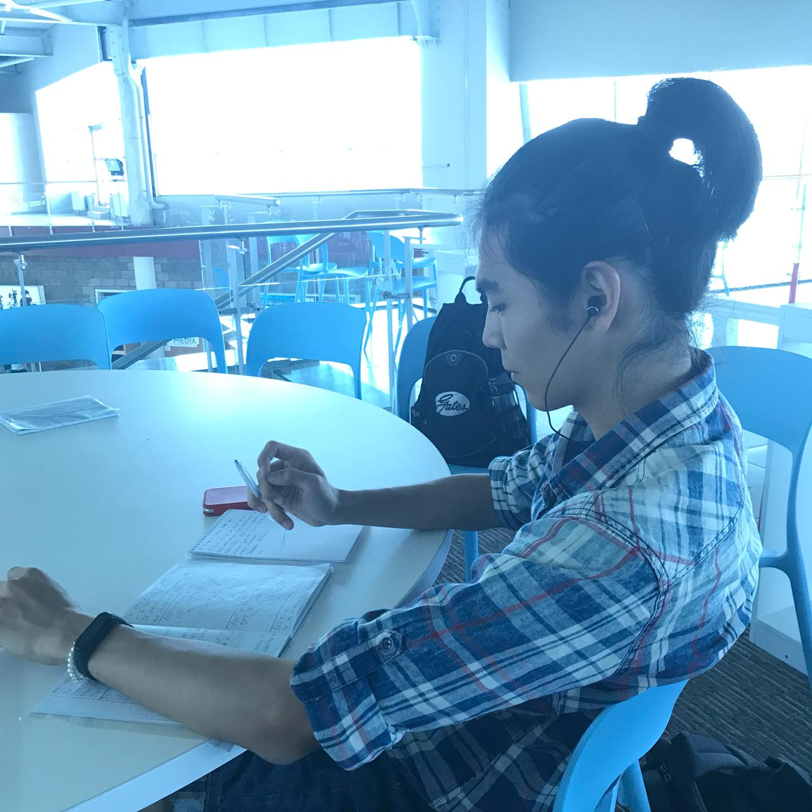

# Third week

Because it is my first week of blogging this course, I will make a little summary of the first week and second.

### First week 
First week was just an introduction to the course, nothing special.

### Second week
My journey started with the simple lab where I realized: networks are essential and anyone who calls himself an engineer must know at least the basics. The lecture was all about the importance of studying things. Next, I found on my email the invitation link to my new Cisco Networking Academy account in which I also found the fact that I was already enrolled in the CCNA essentials course.  
After finishing this course, students of Suleyman Demirel university can take an elective course that continues the Cisco Networking Academy essential course that we are participating in now.
 
The first week on netacad platform students of Suleyman Demirel university studied the first chapter and also tenths chapter. The first chapter was all about "How the networks work". The Internet and WEB technologies are nowadays part of our lives and by "our" lives I mean the life of every people around the world. The Internet is about connecting people, collaboration with different groups of nations, etc.  
Tenths chapter was all about the Application layer of the TCP/IP model. Different protocols for different purposes. For example:

- HTTP also is known as HyperText Transfer Protocol
- HTTPS also is known as HyperText Transfer Protocol Secure
- FTP also is known as File Transfer Protocol
- DNS also is known as Domain Name System

Overall the first week was quite interesting. First experience with Cisco Packet Tracer which is an essential tool for every engineer that wants to work with networks and administrate them

# Third week
Here we studied the ninth chapter. The ninth chapter was all about the transport layer and two main protocols: UDP and TCP. Transport layer -breaks up the data into segments. Preparing data to be transported by the networks layer

Roles of Transport layer:
- Establishing a temporary session between two apps and delivering data between them.
- Links app layer and network layer

Responsibilities:
- Tracking individual conversations
- Segmenting data and reassembling segments
- Identifying the apps

Ip is concerned only with the structure, 
addressing and routing of Packets.
TCP is reliable. Three operations of it:

1. Numbering and tracking data segments transmitted to a specific host from specific app
1. Acknowledging received data
1. Retransmitting any unacknowledged data after a certain period of time.

UDP has a smaller header,therefore it is faster than TCP

TCP features:
- Establishing a session
- Reliable delivery
- Same-order delivery
- Flow control
- State-ful protocol

UDP features:
- Data is reconstructed in the order that is received
- Lost segments are not resend
- No session
- Not informing about resource availability
- Leas header

Transport layer protocol are managing multiple conversations between apps by using header fields that can uniquely identify these apps.
These unique identifiers are the port numbers.

1. Well-known ports (0-1023)
1. Registered ports (1024-49151)
1. Dynamic or private ports (49152-65335)

`netstat` command  
`-n` parameter displays ip addresses and port numbers.

Overall, that is everything that I want to write.

