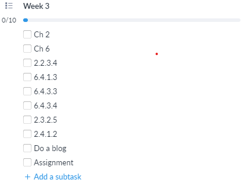

# Fourth week

Now that I'm preparing for the fourth week, I want to start the homeworks & assignments.  
My fourth week's tasks are looking like that:

So my plan is to learn such things as:

- Chapter 2, with these labs: 2.2.3.4, 2.3.2.5, 2.4.1.2
- Chapter 6, with these labs: 6.4.1.3, 6.4.3.3, 6.4.3.4
- Finish an assignment
- Chapter 7
- Chapter 8
- Make a blog

Let's get on with it

### Chapter two
In chapter two (Configure a Network Operating System) I learned how to configure, access and also work with different OS on different intermediary devices.

#### 1. Cisco IOS (which is also known as Internetwork Operating System)

- Operating systems. There was a nice image of most common operating system architecture. I learned that top layer is **shell layer** which is closest to the end users and also is responsible for human/computer interactions. Can be implemented as a CLI or GUI. **Kernel layer** is the most important part of OS that works directly with the hardware, to implement such things, top low-level programmers are writing hardware drivers in order to make computer know with what particular device it is working now and how to work with such concrete device.
- Purpose of OS. CLI on cisco IOS enables to: use a keyboard to run CLI-based network programs, use a keyboard to enter text and text-based commands, view output on monitor.

#### 2. Cisco IOS

- Access methods. Three ways to access the device: **CLI** helps to access the device that you need to configure physically in such cases you will need to use console port, **SSH** helps you to access the device not physically which means by the Internet or internet and since it is SSH  the connection between you and the device is secure, **telnet** helps you to access the device not physically which means the same as in the SSH method by the Internet or internet however this method builds a connection between you and the device in insecure way.

#### 3. Navigate the IOS

- Cisco IOS modes of Operation. CLI using console port and PuTTY.
- Primary command modes. **User EXEC mode** signatured by `'device-name'>`, in such mode consider you are in "READ ONLY" mode. **Privileged EXEC mode** signatured by `"device-name"#`, in such mode consider you are administrator.
- Configuration command modes. **Global configuration mode** signatured by `"device-name"(config)#`. **Line configuration mode** signatured by `"device-name"(config-line)#`, in which you can configure console, SSH, Telnet, AUX lines. **Interface configuration mode** signatured by `"device-name"(config-if)#`.
- Navigate between IOS (which is also known as Internetwork Operating System) modes. `enable/disable` to switch the modes. `"device-name"#configure terminal/exit` to enter global configuration. `"device-name"(config)#line "line-name"` to enter a line sub-configuration.
- Basic IOS (which is also known as Internetwork Operating System) command structure `switch>show ip protocols`

#### Other useful commands

- `"device-name"(config)# hostname "hostname"` - to rename the device
- `"device-name"(config)# enable secret "password"` - set password for Privileged mode
- `"device-name"(config-line)# password "password"` - set password for line
- `"device-name"(config)# service password-encryption` - encrypt all the passwords with light hash algorithm
- `"device-name"# show running-config` - show list of currently running configurations

### Chapter six

Network layer. The main purpose that I understood is: NL encapsulates and passing data to a destination host within a network with minimum overload.

#### 1. Network layer protocols
- NL transports data from source host to destination host via within a network. To accomplish this end-to-end transport, the network layer uses four basic things: Addressing end devices, Encapsulation, Routing, De-encapsulation
- NL protocols are: Internet protocol version 4 (IPv4) and Internet protocol version 6 (IPv6). Their basic characteristics: connectionless, best effort, media independent.

Overall, sender and receiver both do not know nothing, sender just sends and receiver just receives, packets may be lost, however it passes through network effectively, if MTU is too big routers can split packets (this is called fragmentation).

- IPv4 packet headers has interesting headers, main ones are: DS, TTL, Protocol, Source and Destination addresses.
- IPv6 packet headers are more simplified: Version, Traffic class, Flow label, Payload length, Next header, Hop limit.

#### 2. Routing
Routers are connecting different LAN's together which makes them a part of a big network. Therefore, routing is the main part of any network.

#### 3. Routers
Routers are relatively the same as the switches, however it's only on hardware part. Routers are playing a big role in networks infrastructure.

From this subchapter I learned the full algorithm of basic router configuration

1. Hostname
1. All lines has to have a password and login enabled
1. `enable secret` to give a password for Privileged EXEC mode
1. Set a banner
1. Encrypt all passwords
1. Copy all running configurations to a NVRAM

After all that you can configure your interfaces and ip addresses.

### Assignment
Teacher gave me assignments for chapters: 1, 9, 2, 6. It was not that hard, however the way that the questions were build is a bit hard-to-read.

### Chapter 7
This chapter is going to tell me, why Internet protocols has exact this structure and how important is to build a reliable and efficient networks.

#### 1. IPv4 Network addresses
- Binary and decimal conversion. IPv4 address consists of 32 bits all of them are divided by 4 sections (called octets), example: 192.168.10.10.
Computers uses binary representation of addresses, however we as humans use decimal representation. I learned positional notation to convert from binary to decimal and positional value table to convert from decimal to binary.
- IPv4 structure. So there's a network portion and host portion in each address, how can we know which part is host and which is a network. Subnet mask was the solution. Using prefix length we can determine to which network this ip address belongs.
- Also there's a different types of IPv4 communicating: Unicast, Broadcast, Multicast.

I learned different types of IPv4 addresses like these private addresses:
1. 10.0.0.0/8
2. 172.16.0.0/12
3. 192.168.0.0/16

Also there's a bunch of special addresses:
1. Loopback to itself: 127.0.0.0/8 
2. Link-local, using by DHCP: 169.254.0.0/16
3. TEST-net, only for educational purposes: 192.0.2.0/24

Before subnet mask system, we used different classes of networks.

Overall, that's all I want to mention about these subchapter.

#### 2. IPv6 Network addresses
New version of Internet protocol was like a totally new world of the networks.
And because of it's less-interaction-with-humans it all was weird firstly.
Overall, this was an interesting part to study. What I learned? A lot of actually:
 
First of all, there are a lot of possible addresses and because of extremely fast rising of devices connected to the network, IPv4 cannot handle all these amount of things connected together. IPv6 was designed in such way that all the existing network build on IPv4 will coexist with newly created IPv6 engineers build these tools:
1. Dual Stack - helps running both versions of internet protocol
2. Tunneling - transports IPv6 packets over a IPv4 network (by encapsulation)
3. Translation - Using NAT64 to convert from v4 to v6 and vise versa.

The structure of this protocols works closely the same, but on totally different scales.  
The whole address is divided into 8 sections each consists of 16 bits or 4 hexadecimal values. **Preferred format** to write IPv6 address is: x : x : x : x : x : x : x : x, each 'x' mark is actually a 16 bits number.
 
Rules of writing IPv6 address:
1. Omit leading 0s
2. Omit all 0 segments

There are also different types of addresses: Unicast, Multicast, Anycast.
Multicast has 3 types: Global Unicast, Link-local, Unique-local.

 
I also learned two different ways of dynamically assigning IPv6 addresses: SLAAC and DHCPv6. There's RA messages that is being send by routers each 200 seconds.
 
Honestly, I said so many about this protocol, but it took me 3 hours to read so I'm tired now.

