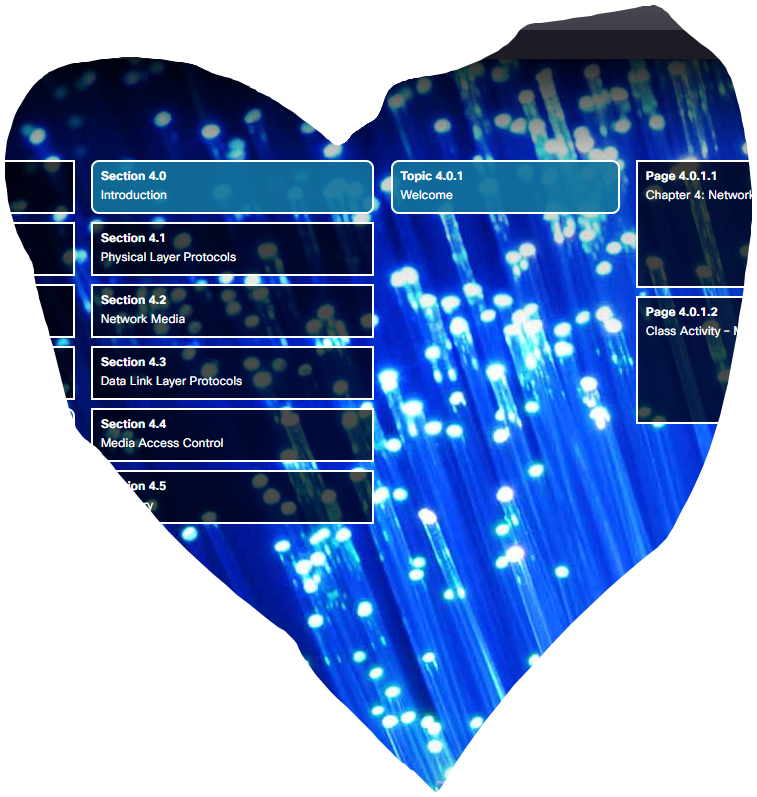

# Sixth week

Previous week wasn't that interesting, because of it's simplicity.  
In ICT course we learned how to calculate the ip address, therefore nothing special.

 
However, this week is much more promising (especially the lab part).

So, for now (by now I mean monday) I've only got the fourth chapter to read and also lab 4.2.2.7. **Let's dive into it!**

## Fourth chapter
First, of all there are literally six sections to examine. Well, I have only one option....

 

From **introduction** part I got the point of this chapter, to show us the Physical and Data link layers working together forming Network Layer in the TCP/IP model.

 

**Physical layer** is responsible for transmitting via network media. There is a different types of media:
1. Coper cable - electrical pulses
1. Fiber-optic - patterns of light
1. Wireless - patterns of microwaves

Main functions of physical layer:
1. Use a physical components of network
1. Encoding the signal into the flow of bits
1. Signaling the data via a network media

Bandwidth is the capacity of a medium to carry data (in a given amount of time) which is using the b/s metric or bits per second.
 
Throughput is the measure of the transfer of bits across the media over a given period of time.

That's all the notes I have got about the physical layer.

There are a lot of different types of **network media** with their own properties.
For example:

1. Coper cables are limited to their distance. Signal could be interfered by EMI or RFI or Crosstalk. A few coper media types: UTP (Categories 3, 5 and 5e, 6), STP, Coaxial. Some UTP properties: Cancellation, Varying the number of twists per wire pair.
1. Fiber media types: single-mode, multi-mode.
1. Properties of wireless media: coverage area, interference, security, shared medium.

That's all notes I have got about the network media properties.

<!-- continue chapter 4 -->

## Lab work
On lab we passed 4th task from previous lab. That was actually a challenge because of misunderstanding of some little beginning steps. However, I managed to pass. After such task we had a simple quiz for IP calculations. Overall, it was quite easy except for time limitations and my poor math calculation skills.

## Summary

This week wasn't that hard. All the problem is time this far. I need to finish my work to give more time to this course.